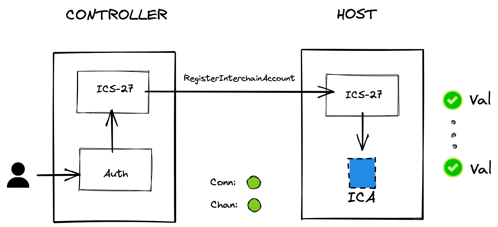
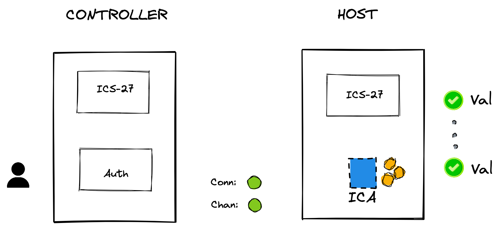
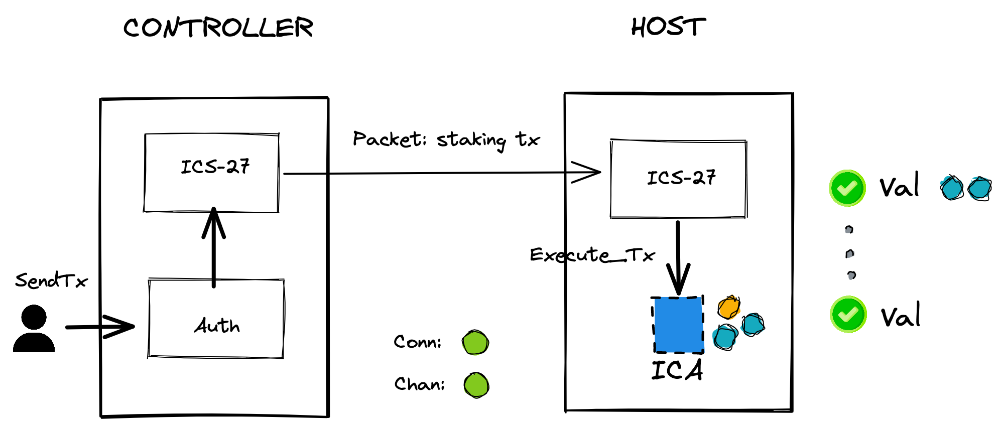

# Interchain Accounts

Developers integrating Interchain Accounts may choose to firstly enable host chain functionality, and add authentication modules later as desired.
Documentation regarding authentication modules can be found in the [IBC Developer Documentation](https://ibc.cosmos.network/main/apps/interchain-accounts/overview.html).

## Overview 

The following repository contains a basic example of an Interchain Accounts authentication module and serves as a developer guide for teams that wish to use interchain accounts functionality.

The Interchain Accounts module is now maintained within the `ibc-go` repository [here](https://github.com/cosmos/ibc-go/tree/main/modules/apps/27-interchain-accounts). 
Interchain Accounts is now available in the [`v3.0.0`](https://github.com/cosmos/ibc-go/releases/tag/v3.0.0) release of `ibc-go`.

### Developer Documentation

Interchain Accounts developer docs can be found on the IBC documentation website.

https://ibc.cosmos.network/main/apps/interchain-accounts/overview.html

## Setup

1. Clone this repository and build the application binary

```bash
git clone https://github.com/cosmos/interchain-accounts-demo.git
cd interchain-accounts

make install 
```

2. Download and install an IBC relayer. ([hermes](https://hermes.informal.systems/), [go relayer](https://github.com/cosmos/relayer) or both )
```bash
# hermes
cargo install --version 0.15.0 ibc-relayer-cli --bin hermes --locked

#go relayer (make sure to use v2.0.0-rc4 or later!)
git clone https://github.com/cosmos/relayer.git
cd relayer && git checkout v2.0.0-rc4
make install
```

3. Bootstrap two chains, configure the relayer and create an IBC connection (on top of clients that are created as well)
```bash
# hermes
make init-hermes

# go relayer
make init-golang-relayer
```

:warning: **NOTE:** When you want to use both relayers interchangeably, using both of these `make` commands will set up two seperate connections (which is not needed and can lead to confusion). In the case of using both relayers, perform:
```bash
make init-golang-rly
./network/hermes/restore-keys.sh
```

4. Start the relayer
```bash
#hermes
make start-hermes

#go relayer
make start-golang-rly
```

:exclamation: **NOTE:** It is abstracted away in the script files, but in case you want to manually run `rly start` with interchain accounts, you will need to add this flag: `-p events` to it.

> This is the situation *before* `make init-*`. The blockchains are not live yet.


> This is the situation *after* `make init-*`. The chain binary's have been built and started, and an IBC connection between controller and host chains has been set up.


## Demo

**NOTE:** For the purposes of this demo the setup scripts have been provided with a set of hardcoded mnemonics that generate deterministic wallet addresses used below.

```bash
# Store the following account addresses within the current shell env
export WALLET_1=$(icad keys show wallet1 -a --keyring-backend test --home ./data/test-1) && echo $WALLET_1;
export WALLET_2=$(icad keys show wallet2 -a --keyring-backend test --home ./data/test-1) && echo $WALLET_2;
export WALLET_3=$(icad keys show wallet3 -a --keyring-backend test --home ./data/test-2) && echo $WALLET_3;
export WALLET_4=$(icad keys show wallet4 -a --keyring-backend test --home ./data/test-2) && echo $WALLET_4;
```

### Registering an Interchain Account via IBC

Register an Interchain Account using the `intertx register` cmd. 
Here the message signer is used as the account owner.

```bash
# Setup up chain test-1 client configuration settings
icad config keyring-backend test --home ./data/test-1;
icad config node tcp://localhost:16657 --home ./data/test-1;
icad config --home ./data/test-1;

# Setup up chain test-1 client configuration settings
icad config keyring-backend test --home ./data/test-2;
icad config node tcp://localhost:26657 --home ./data/test-2;
icad config --home ./data/test-2;

# Register an interchain account on behalf of WALLET_1 where chain test-2 is the interchain accounts host
icad tx intertx register --from $WALLET_1 --connection connection-0 --chain-id test-1 --home ./data/test-1 --node tcp://localhost:16657 --keyring-backend test -y

# Query the address of the interchain account
icad query intertx interchainaccounts connection-0 $WALLET_1 --home ./data/test-1

# Store the interchain account address by parsing the query result: cosmos1hd0f4u7zgptymmrn55h3hy20jv2u0ctdpq23cpe8m9pas8kzd87smtf8al
export ICA_ADDR=$(icad query intertx interchainaccounts connection-0 $WALLET_1 --home ./data/test-1 -o json | jq -r '.interchain_account_address') && echo $ICA_ADDR
```

> This is the situation after registering the ICA. A channel has been created and an ICA has been registered on the host.


#### Funding the Interchain Account wallet

Allocate funds to the new Interchain Account wallet by using the `bank send` cmd.
Note this is executed on the host chain to provide the account with an initial balance to execute transactions.

```bash
# Query the interchain account balance on the host chain. It should be empty.
icad q bank balances $ICA_ADDR --home ./data/test-2

# Send funds to the interchain account.
icad tx bank send $WALLET_3 $ICA_ADDR 10000stake --home ./data/test-2 -y

# Query the balance once again and observe the changes
icad q bank balances $ICA_ADDR --home ./data/test-2
```

> This is the situation after funding the ICA.


#### Sending Interchain Account transactions

Send Interchain Accounts transactions using the `intertx submit` cmd. 
This command accepts a generic `sdk.Msg` JSON payload or path to JSON file as an arg.

- **Example 1:** Staking Delegation

```bash
# Output the host chain validator operator address: cosmosvaloper1qnk2n4nlkpw9xfqntladh74w6ujtulwnmxnh3k
cat ./data/test-2/config/genesis.json | jq -r '.app_state.genutil.gen_txs[0].body.messages[0].validator_address'

# Submit a staking delegation tx using the interchain account via ibc
icad tx intertx submit \
'{
    "@type":"/cosmos.staking.v1beta1.MsgDelegate",
    "delegator_address":"cosmos15ccshhmp0gsx29qpqq6g4zmltnnvgmyu9ueuadh9y2nc5zj0szls5gtddz",
    "validator_address":"cosmosvaloper1qnk2n4nlkpw9xfqntladh74w6ujtulwnmxnh3k",
    "amount": {
        "denom": "stake",
        "amount": "1000"
    }
}' --connection connection-0 --from $WALLET_1 --home ./data/test-1 -y

# Alternatively provide a path to a JSON file
icad tx intertx submit [path/to/msg.json] --connection connection-0 --from $WALLET_1 --home ./data/test-1 -y

# Wait until the relayer has relayed the packet

# Inspect the staking delegations on the host chain
icad q staking delegations-to cosmosvaloper1qnk2n4nlkpw9xfqntladh74w6ujtulwnmxnh3k --home ./data/test-2
```

> This is the situation before after sending the staking tx. The user who is the owner of the ICA has staked funds on the host chain to a validator of choice through an interchain accounts packet.


- **Example 2:** Bank Send

```bash
# Submit a bank send tx using the interchain account via ibc
icad tx intertx submit \
'{
    "@type":"/cosmos.bank.v1beta1.MsgSend",
    "from_address":"cosmos15ccshhmp0gsx29qpqq6g4zmltnnvgmyu9ueuadh9y2nc5zj0szls5gtddz",
    "to_address":"cosmos10h9stc5v6ntgeygf5xf945njqq5h32r53uquvw",
    "amount": [
        {
            "denom": "stake",
            "amount": "1000"
        }
    ]
}' --connection connection-0 --from $WALLET_1 --home ./data/test-1 -y

# Alternatively provide a path to a JSON file
icad tx intertx submit [path/to/msg.json] --connection connection-0 --from $WALLET_1 --home ./data/test-1 -y

# Wait until the relayer has relayed the packet

# Query the interchain account balance on the host chain
icad q bank balances $ICA_ADDR --chain-id test-2
```

#### Testing timeout scenario

1. Stop the relayer process and send an interchain accounts transaction using one of the examples provided above.

2. Wait for approx. 1 minute for the timeout to elapse.

3. Restart the relayer process

```bash
#hermes
make start-hermes

#go relayer
make start-golang-rly
```

4. Observe the packet timeout and relayer reacting appropriately (issuing a MsgTimeout to testchain `test-1`).

5. Due to the nature of ordered channels, the timeout will subsequently update the state of the channel to `STATE_CLOSED`.
Observe both channel ends by querying the IBC channels for each node.

```bash
# inspect channel ends on test chain 1
icad q ibc channel channels --home ./data/test-1

# inspect channel ends on test chain 2
icad q ibc channel channels --home ./data/test-2
```

6. Open a new channel for the existing interchain account on the same connection.

```bash
icad tx intertx register --from $WALLET_1 --connection connection-0 --home ./data/test-1 -y
```

7. Inspect the IBC channels once again and observe a new creately interchain accounts channel with `STATE_OPEN`.

```bash
# inspect channel ends on test chain 1
icad q ibc channel channels --home ./data/test-1

# inspect channel ends on test chain 2
icad q ibc channel channels --home ./data/test-2
```

## Collaboration

Please use conventional commits  https://www.conventionalcommits.org/en/v1.0.0/

```
chore(bump): bumping version to 2.0
fix(bug): fixing issue with...
feat(featurex): adding feature...
```

### Groups Demo

Placeholder section for `x/group` integration. This is a work-in-progress and will either be moved to a separate guide or replace the current demo.
This requires a fix to `x/group` in cosmos-sdk to ensure events are correctly propagated to the current context and emitted on successful execution of a group propsal.
This fix will be included in the next patch release of the sdk: `v0.46.1`

See: https://github.com/cosmos/cosmos-sdk/pull/12888

- Setup the CLI client configurations for test chains `test-1` and `test-2`.

```
icad config keyring-backend test --home ./data/test-1;
icad config node tcp://localhost:16657 --home ./data/test-1;
icad config --home ./data/test-1;

icad config keyring-backend test --home ./data/test-2;
icad config node tcp://localhost:26657 --home ./data/test-2;
icad config --home ./data/test-2;
```

- Create a new group using the `members.json` file provided.

```
icad tx group create-group $WALLET_1 test-metadata members.json --from $WALLET_1 --home ./data/test-1

icad q group group-info 1 --home ./data/test-1
```

- Create a new group policy using the `policy.json` file provided. A new `ThresholdDecisionPolicy` is created with a threshold of `2` and voting period of `60s`.

```
icad tx group create-group-policy $WALLET_1 1 policy-meta policy.json --home ./data/test-1

icad q group group-policies-by-group 1 --home ./data/test-1
```

- Extract the group policy address from the response JSON.
```
export GROUP_POLICY_ADDR=$(icad q group group-policies-by-group 1 --home ./data/test-1 --home ./data/test-1 -o json | jq -r '.group_policies[0].address') && echo $GROUP_POLICY_ADDR
cosmos1afk9zr2hn2jsac63h4hm60vl9z3e5u69gndzf7c99cqge3vzwjzsfwkgpd
```

- Send some funds to the group policy address

```
icad tx bank send $WALLET_1 $GROUP_POLICY_ADDR 10000000stake --home ./data/test-1
```

- Submit a new propsal to execute a `/intertx.MsgRegisterAccount` where the account owner is the group policy address.

```
icad tx group submit-proposal prop-register.json --home ./data/test-1 --from $WALLET_1

icad q group proposal 1 --home ./data/test-1
```

- Vote on the propsal using both of the group members.

```
icad tx group vote 1 $WALLET_1 --home ./data/test-1 VOTE_OPTION_YES meta --from $WALLET_1
icad tx group vote 1 $WALLET_2 --home ./data/test-1 VOTE_OPTION_YES meta --from $WALLET_2
```

- Execute the proposal once the voting period of `60s` has elapsed and votes have been tallied.

```
icad tx group exec 1 --from $WALLET_1 --home ./data/test-1 --gas 500000 -b block
```

- Submit a new proposal to execute a `/intertx.MsgSubmitTx` that includes a `MsgDelegate` to execute using the interchain account registered on chain `test-2`.

```
icad tx group submit-proposal prop-sendtx.json --home ./data/test-1 --from $WALLET_1

icad q group proposal 2 --home ./data/test-1
```

- Once again, vote on the proposal with both of the group members.

```
icad tx group vote 2 $WALLET_1 --home ./data/test-1 VOTE_OPTION_YES meta --from $WALLET_1
icad tx group vote 2 $WALLET_2 --home ./data/test-1 VOTE_OPTION_YES meta --from $WALLET_2
```

- Execute the propsal once it has been accepted.

```
icad tx group exec 2 --from $WALLET_1 --home ./data/test-1 --gas 500000 -b block
```